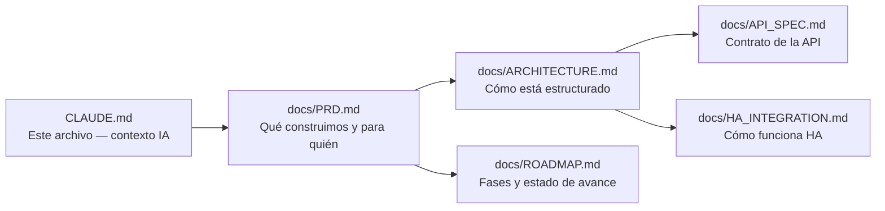
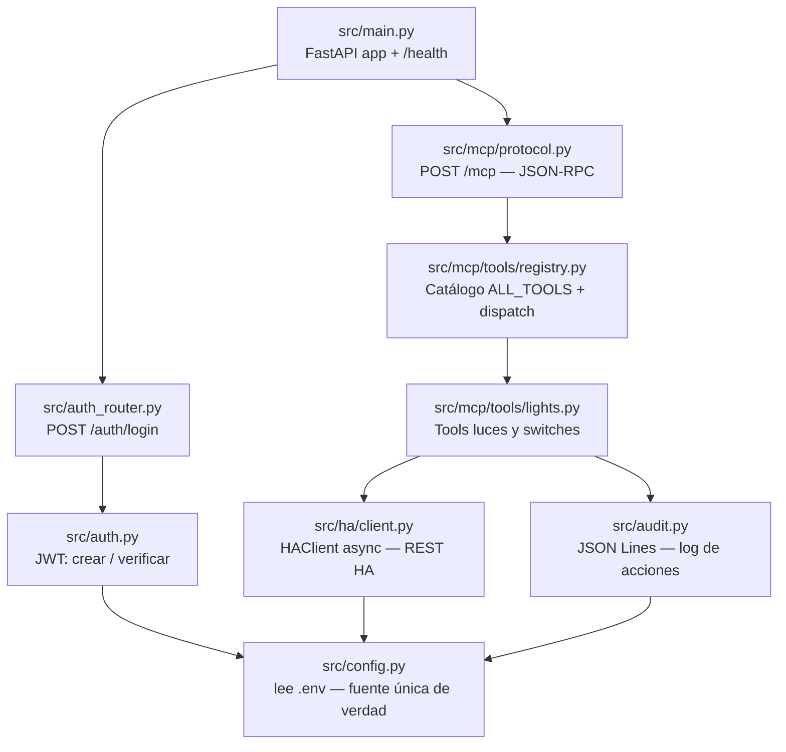

# CLAUDE.md — Guía para asistentes IA

## Qué es este proyecto

Servidor MCP (Model Context Protocol) que expone Home Assistant como herramientas para Heinzbot (app Android multi-LLM de Eli Mandujano). Eli es nuevo en programación — explicar cada decisión técnica en términos simples.

## Documentación — leer primero

**Prioridad de lectura para una tarea nueva:**
1. `CLAUDE.md` (este archivo) — reglas del proyecto
2. `docs/PRD.md` — qué se está construyendo y por qué
3. `docs/ARCHITECTURE.md` — decisiones ya tomadas (no reinventar)
4. El archivo de código relevante a la tarea

## Stack

- Python 3.10+ / FastAPI / uvicorn
- Protocolo MCP Streamable HTTP (spec 2025-03-26)
- Auth: JWT (8h), endpoint POST /auth/login
- Backend: Home Assistant REST API (aiohttp async)
- Despliegue: systemd + Nginx reverse proxy en VPS Hostinger (Ubuntu)
- Puerto: 8002 (8001 está ocupado por odoo-mcp)

## Estructura del código

## Reglas de desarrollo

- Todo el código Python en `src/`
- Nunca hardcodear credenciales — siempre desde `config.py`
- Las tools MCP siempre validan el JWT antes de ejecutar
- Usar `aiohttp` async para llamadas a HA — nunca requests síncronos
- Registrar en `audit.jsonl` toda acción de escritura
- Para agregar una nueva tool: crear `src/mcp/tools/nuevo.py` + registrar en `registry.py` — no tocar el resto
- La documentación en `docs/` debe mantenerse actualizada con cada cambio relevante

## Patrones establecidos (no cambiar)

| Patrón | Dónde | Por qué |
|--------|-------|---------|
| Pydantic Settings | `config.py` | Fuente única de verdad para config |
| Bearer JWT en cada /mcp | `protocol.py` | Seguridad |
| JSON-RPC 2.0 | `protocol.py` | Spec MCP |
| isError en result (no HTTP error) | `protocol.py` | Spec MCP — los errores de tool van en result |
| log_action solo en escrituras | `lights.py` | No contaminar el log con lecturas |

## Referencia

- Arquitectura basada en: https://github.com/elite3210/odoo_mpc
- Spec MCP: https://spec.modelcontextprotocol.io/specification/2025-03-26/
- HA REST API: https://developers.home-assistant.io/docs/api/rest/
