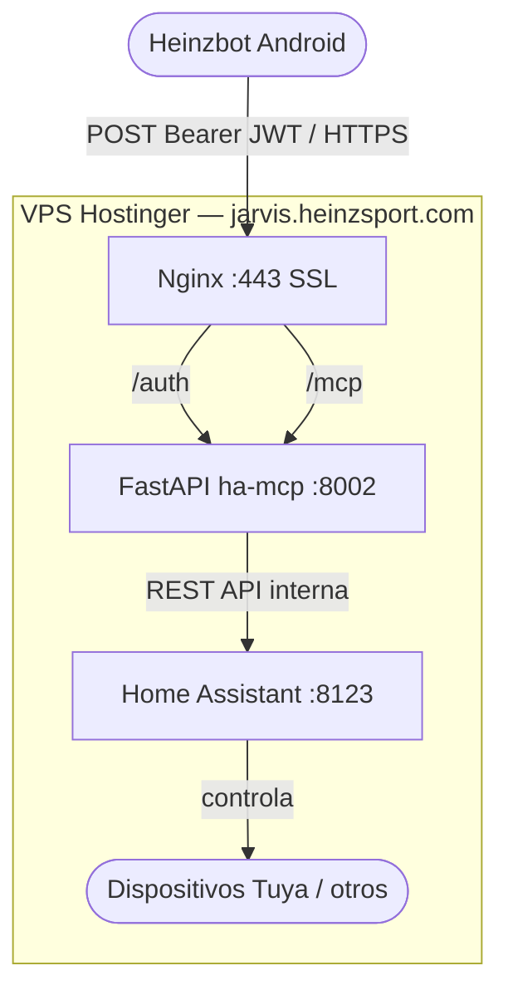
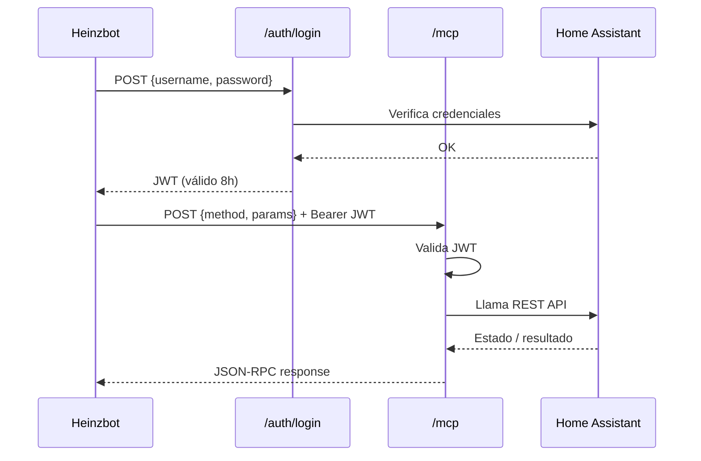
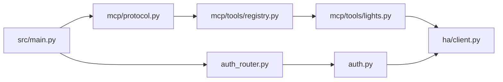

# ha-mcp

Servidor MCP (Model Context Protocol) para controlar Home Assistant desde Heinzbot.

## Arquitectura



## Flujo de autenticación



## Herramientas disponibles

| Tool | Descripción |
|------|-------------|
| `ha_list_lights` | Lista luces y switches disponibles |
| `ha_get_light_state` | Estado actual de una luz/switch |
| `ha_turn_on_light` | Enciende (con brillo y color opcionales) |
| `ha_turn_off_light` | Apaga una luz o switch |

## Estructura del proyecto



## Instalación en VPS

```bash
# 1. Clonar
mkdir -p /opt/ha-mcp && cd /opt/ha-mcp
git clone https://github.com/elite3210/ha_mcp.git .

# 2. Entorno virtual
python3 -m venv .venv
source .venv/bin/activate
pip install -r requirements.txt

# 3. Configurar
cp .env.example .env
nano .env   # completar HA_TOKEN y JWT_SECRET

# 4. Permisos
chown -R odoo:odoo /opt/ha-mcp

# 5. Servicio systemd
cp systemd/ha-mcp.service /etc/systemd/system/
systemctl daemon-reload
systemctl enable ha-mcp
systemctl start ha-mcp

# 6. Verificar
curl http://127.0.0.1:8002/health
```

## Variables de entorno

Ver `.env.example` para la lista completa.

## Generar JWT_SECRET

```bash
openssl rand -hex 32
```
