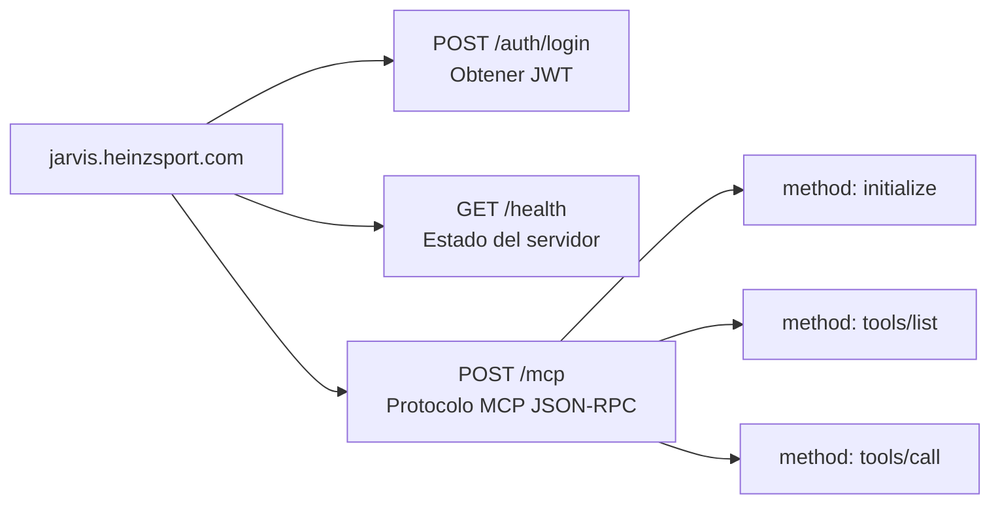
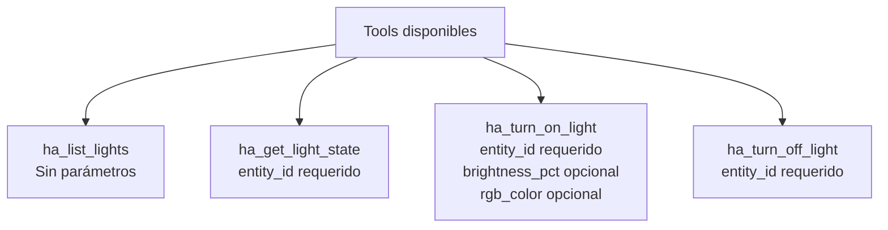
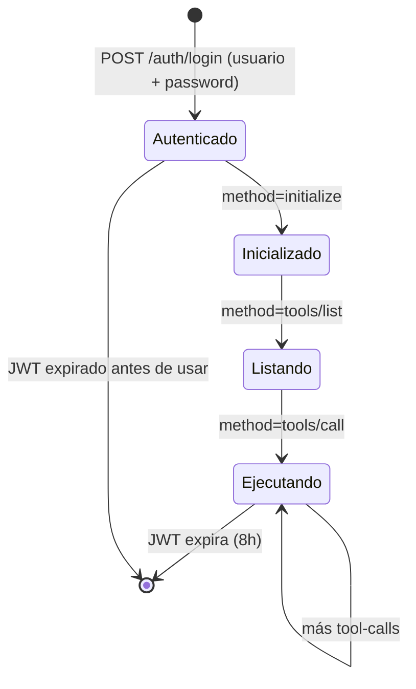

# API_SPEC.md — Especificación de la API

**Proyecto:** ha-mcp  
**Base URL producción:** `https://jarvis.heinzsport.com`  
**Versión protocolo MCP:** `2025-03-26`

---

## 1. Mapa de endpoints



---

## 2. Autenticación

### `POST /auth/login`

Verifica credenciales de Home Assistant y devuelve un JWT.

**Headers:**
```
Content-Type: application/json
```

**Request body:**
```json
{
  "username": "eli",
  "password": "tu_password_de_ha"
}
```

**Response exitosa (200):**
```json
{
  "access_token": "eyJhbGciOiJIUzI1NiIsInR5cCI6IkpXVCJ9...",
  "token_type": "bearer",
  "expires_in": 28800
}
```

**Response fallida (401):**
```json
{
  "detail": "Credenciales incorrectas"
}
```

**Flujo:**

```mermaid
flowchart LR
    A[Cliente] -->|POST username+password| B[/auth/login]
    B -->|verifica contra| C[Home Assistant]
    C -->|OK| D[Genera JWT 8h]
    C -->|Fallo| E[401 Unauthorized]
    D --> F[Devuelve token]
```

---

## 3. Health check

### `GET /health`

Verifica que el servidor está corriendo. No requiere autenticación.

**Response (200):**
```json
{
  "status": "ok",
  "service": "ha-mcp"
}
```

---

## 4. Protocolo MCP — `POST /mcp`

Todos los métodos MCP van al mismo endpoint. El campo `method` del cuerpo determina la acción.

**Headers requeridos en todas las llamadas:**
```
Authorization: Bearer <JWT>
Content-Type: application/json
```

### 4.1 — `initialize`

El LLM se presenta al servidor al iniciar la sesión.

**Request:**
```json
{
  "jsonrpc": "2.0",
  "id": 1,
  "method": "initialize",
  "params": {
    "protocolVersion": "2025-03-26",
    "clientInfo": { "name": "heinzbot", "version": "1.0" }
  }
}
```

**Response:**
```json
{
  "jsonrpc": "2.0",
  "id": 1,
  "result": {
    "protocolVersion": "2025-03-26",
    "serverInfo": {
      "name": "ha-mcp",
      "version": "1.0.0",
      "description": "MCP server para Home Assistant — Heinzbot"
    },
    "capabilities": { "tools": {} }
  }
}
```

---

### 4.2 — `tools/list`

El LLM consulta qué tools están disponibles.

**Request:**
```json
{
  "jsonrpc": "2.0",
  "id": 2,
  "method": "tools/list",
  "params": {}
}
```

**Response:**
```json
{
  "jsonrpc": "2.0",
  "id": 2,
  "result": {
    "tools": [
      {
        "name": "ha_list_lights",
        "description": "Lista todos los dispositivos de luz y switches disponibles en Home Assistant.",
        "inputSchema": { "type": "object", "properties": {}, "required": [] }
      },
      {
        "name": "ha_get_light_state",
        "description": "Consulta el estado actual de una luz o switch específico.",
        "inputSchema": {
          "type": "object",
          "properties": {
            "entity_id": { "type": "string", "description": "ID de la entidad, ej: light.salon" }
          },
          "required": ["entity_id"]
        }
      },
      {
        "name": "ha_turn_on_light",
        "description": "Enciende una luz o switch.",
        "inputSchema": {
          "type": "object",
          "properties": {
            "entity_id": { "type": "string" },
            "brightness_pct": { "type": "integer", "minimum": 1, "maximum": 100 },
            "rgb_color": { "type": "array", "items": { "type": "integer" }, "minItems": 3, "maxItems": 3 }
          },
          "required": ["entity_id"]
        }
      },
      {
        "name": "ha_turn_off_light",
        "description": "Apaga una luz o switch.",
        "inputSchema": {
          "type": "object",
          "properties": {
            "entity_id": { "type": "string" }
          },
          "required": ["entity_id"]
        }
      }
    ]
  }
}
```

---

### 4.3 — `tools/call`

El LLM ejecuta una tool específica.

**Request — apagar una luz:**
```json
{
  "jsonrpc": "2.0",
  "id": 3,
  "method": "tools/call",
  "params": {
    "name": "ha_turn_off_light",
    "arguments": {
      "entity_id": "light.salon"
    }
  }
}
```

**Response exitosa:**
```json
{
  "jsonrpc": "2.0",
  "id": 3,
  "result": {
    "content": [
      { "type": "text", "text": "Salón apagado correctamente." }
    ],
    "isError": false
  }
}
```

**Response con error de tool:**
```json
{
  "jsonrpc": "2.0",
  "id": 3,
  "result": {
    "content": [
      { "type": "text", "text": "Error: Entity not found: light.salon" }
    ],
    "isError": true
  }
}
```

> Nota: los errores de tool se devuelven con HTTP 200 y `isError: true`, no con HTTP 4xx/5xx. Así lo define la spec MCP.

---

## 5. Catálogo de tools v1.0



---

## 6. Códigos de error JSON-RPC

| Código | Significado |
|--------|-------------|
| `-32700` | Parse error — JSON malformado |
| `-32600` | Invalid request — falta campo requerido |
| `-32601` | Method not found — método no implementado |
| `-32602` | Invalid params — parámetros incorrectos |
| HTTP 401 | JWT inválido o expirado |

---

## 7. Ciclo de vida de una sesión MCP


