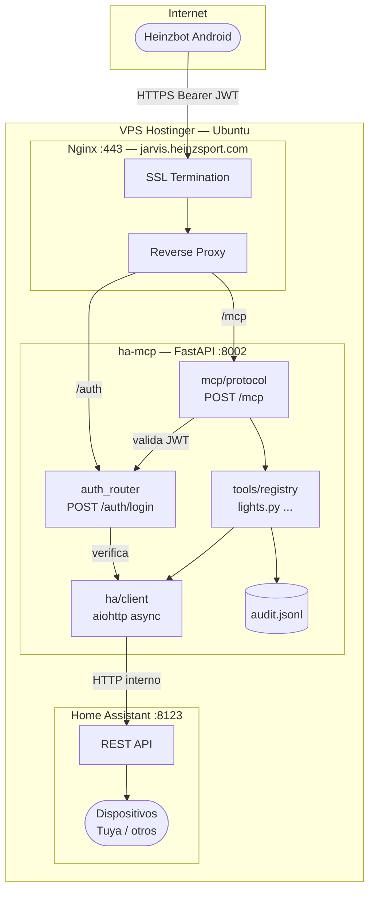
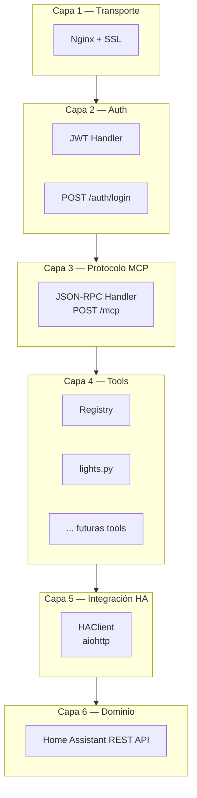
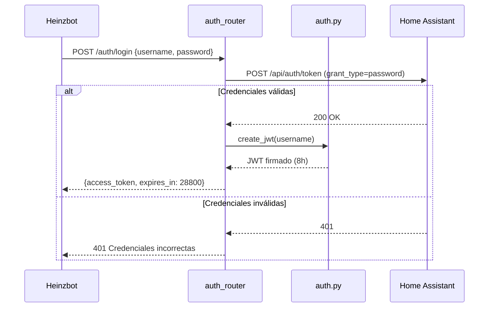
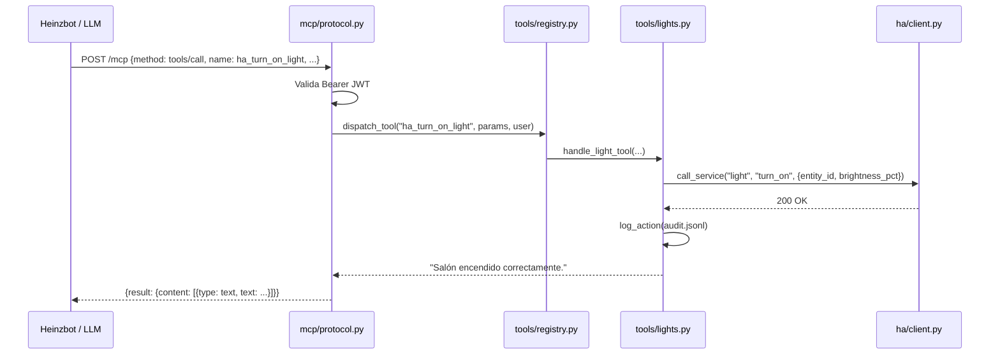
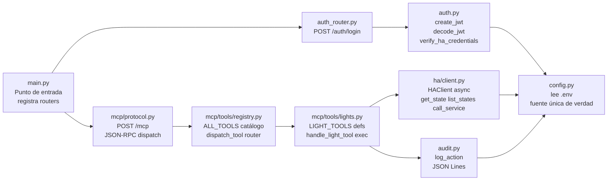
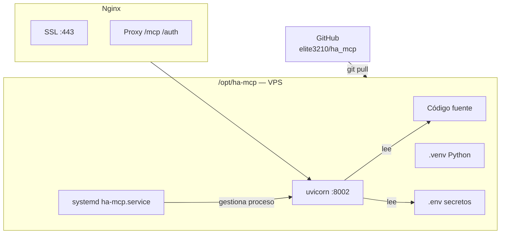

# ARCHITECTURE.md — Arquitectura del Sistema

**Proyecto:** ha-mcp  
**Versión:** 1.0  
**Última actualización:** 2026-06-15

---

## 1. Visión general

ha-mcp es un servidor intermediario (middleware) que traduce el protocolo MCP — usado por LLMs para hacer tool-calls — en llamadas a la REST API de Home Assistant.

---

## 2. Capas del sistema

Cada capa tiene una única responsabilidad. Una nueva tool solo agrega código en L4 — las demás capas no cambian.

---

## 3. Decisiones de arquitectura

### DA-01 — FastAPI como framework

**Decisión:** Usar FastAPI (Python).  
**Razón:** El proyecto odoo-mcp ya usa FastAPI y está funcionando en el mismo VPS. Reusar el mismo stack evita instalar nuevas dependencias y el usuario ya conoce el patrón de despliegue.  
**Alternativas descartadas:** Flask (no async nativo), Node.js (cambio de lenguaje).

### DA-02 — MCP Streamable HTTP (no SSE)

**Decisión:** Implementar el protocolo MCP sobre HTTP puro (POST).  
**Razón:** Heinzbot hace tool-calls síncronas. No necesitamos streaming de eventos. HTTP puro es más simple y compatible con Nginx sin configuración extra.  
**Spec de referencia:** `2025-03-26`

### DA-03 — Long-Lived Token de HA como credencial del servidor

**Decisión:** El servidor usa un token de larga duración de HA (variable `HA_TOKEN`) para todas las llamadas internas.  
**Razón:** Simplifica la arquitectura. El control de acceso lo hace el JWT propio del servidor. No necesitamos re-autenticar contra HA en cada llamada.  
**Implicación:** El `HA_TOKEN` nunca sale del servidor. Los clientes solo ven JWTs de 8h.

### DA-04 — Auditoría en JSON Lines (no base de datos)

**Decisión:** Registrar acciones en un archivo `.jsonl` local.  
**Razón:** Simplicidad de operación. Sin dependencia de base de datos extra. El archivo es legible con `cat` o `jq`. Suficiente para la escala actual (un usuario).  
**Alternativa futura:** SQLite si se necesita búsqueda o múltiples usuarios.

### DA-05 — Puerto 8002 (no 8001)

**Decisión:** El servidor escucha en el puerto 8002.  
**Razón:** El puerto 8001 está ocupado por odoo-mcp en el mismo VPS. Usar 8002 evita conflictos.

---

## 4. Flujo de autenticación

---

## 5. Flujo de una tool-call

---

## 6. Estructura de archivos y responsabilidades

---

## 7. Despliegue en producción

---

## 8. Consideraciones de seguridad

| Riesgo | Mitigación |
|--------|-----------|
| Interceptación de tráfico | HTTPS obligatorio via Nginx + Let's Encrypt |
| Acceso sin autenticar | JWT requerido en todo endpoint `/mcp` |
| Exposición del HA_TOKEN | Vive solo en `.env` del servidor, nunca sale |
| JWT robado | Expiración de 8h, sin refresh token |
| Escalada de privilegios | El servidor corre como usuario `odoo` (sin root) |
| Log de acciones | `audit.jsonl` registra quién hizo qué y cuándo |
