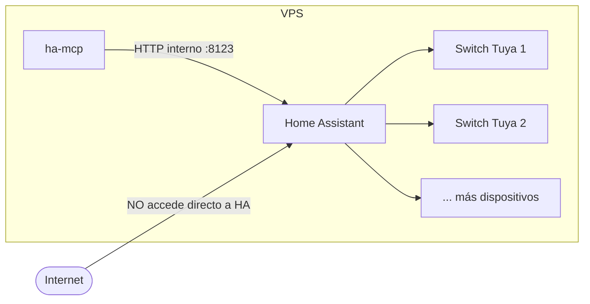
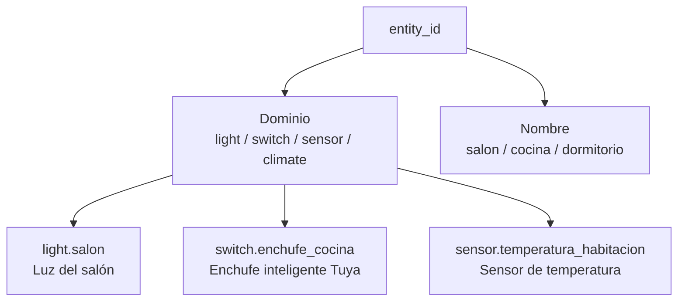
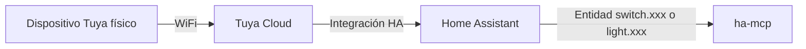
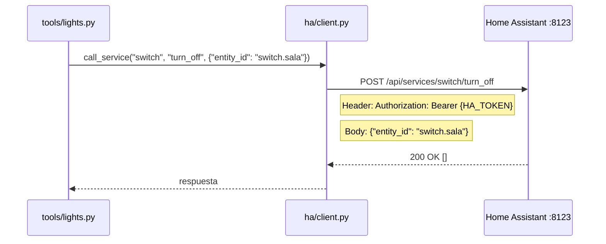
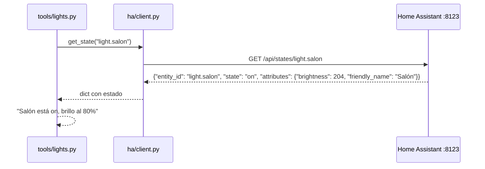
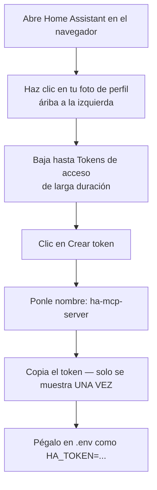
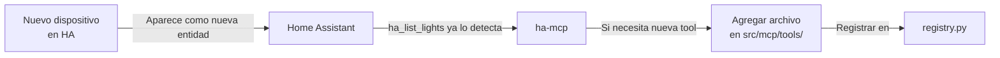

# HA_INTEGRATION.md — Integración con Home Assistant

**Proyecto:** ha-mcp  
**HA URL interna:** `http://127.0.0.1:8123`

---

## 1. Qué es Home Assistant

Home Assistant (HA) es una plataforma de domótica open-source que centraliza el control de todos los dispositivos inteligentes del hogar. En este proyecto, HA corre como servicio en el VPS y expone una REST API que nuestro servidor ha-mcp consume.



> HA no está expuesto directamente a internet — solo ha-mcp lo consume internamente. Esto es una medida de seguridad importante.

---

## 2. Cómo funciona la REST API de HA

Home Assistant expone una REST API en `http://127.0.0.1:8123/api/`. Todas las llamadas llevan un header de autorización con el Long-Lived Token.

### Endpoints clave que usa ha-mcp

| Endpoint | Método | Qué hace |
|----------|--------|----------|
| `/api/` | GET | Verifica que HA está corriendo |
| `/api/states` | GET | Lista todas las entidades y su estado |
| `/api/states/{entity_id}` | GET | Estado de una entidad específica |
| `/api/services/{domain}/{service}` | POST | Ejecuta un servicio (encender, apagar, etc.) |
| `/api/auth/token` | POST | Verifica usuario/contraseña (para nuestro login) |

---

## 3. El concepto de entidad en HA

En Home Assistant, cada dispositivo o sensor es una **entidad** con un `entity_id` en formato `dominio.nombre`.



### Dominios relevantes para este proyecto

| Dominio | Descripción | Servicios disponibles |
|---------|-------------|----------------------|
| `light` | Luces inteligentes | `turn_on`, `turn_off`, `toggle` |
| `switch` | Switches/enchufes | `turn_on`, `turn_off`, `toggle` |
| `sensor` | Sensores (solo lectura) | — (solo GET states) |
| `climate` | Climatización | `set_temperature`, `set_hvac_mode` |

---

## 4. Tus dispositivos actuales (Tuya)

Los switches WiFi Tuya pueden aparecer en HA como dominio `switch` o `light` dependiendo de cómo los clasificó la integración Tuya.



### Cómo encontrar el entity_id de tus dispositivos

En la interfaz de HA:
1. Ir a **Configuración → Dispositivos y servicios → Entidades**
2. Buscar tu dispositivo
3. El `entity_id` aparece debajo del nombre (ej: `switch.sala_switch`)

O con nuestra tool `ha_list_lights` — lista automáticamente todos los switches y luces.

---

## 5. Cómo llama ha-mcp a la API de HA

### Ejemplo: apagar `switch.sala`



### Ejemplo: consultar estado de `light.salon`



---

## 6. El Long-Lived Access Token de HA

Este token le da permiso a ha-mcp para actuar en nombre de un usuario de HA. Es como una contraseña permanente del servidor.

### Cómo crearlo



> **Importante:** El token solo se muestra una vez al crearlo. Si lo pierdes, debes crear uno nuevo y actualizar el `.env`.

---

## 7. Verificación de la conexión con HA

Desde el VPS, puedes verificar que HA responde correctamente:

```bash
# Reemplaza TU_TOKEN con el valor real del HA_TOKEN
curl -s http://127.0.0.1:8123/api/ \
  -H "Authorization: Bearer TU_TOKEN" | python3 -m json.tool
```

Respuesta esperada:
```json
{
  "message": "API running."
}
```

---

## 8. Estructura de respuesta de estado (HA → ha-mcp)

Cuando consultamos `/api/states/{entity_id}`, HA responde:

```json
{
  "entity_id": "switch.sala_switch",
  "state": "on",
  "attributes": {
    "friendly_name": "Switch Sala",
    "device_class": "switch",
    "icon": "mdi:power-socket"
  },
  "last_changed": "2026-06-15T10:30:00+00:00",
  "last_updated": "2026-06-15T10:30:00+00:00"
}
```

| Campo | Descripción |
|-------|-------------|
| `entity_id` | Identificador único |
| `state` | `on`, `off`, `unavailable`, `unknown` |
| `attributes.friendly_name` | Nombre legible para el usuario |
| `attributes.brightness` | Brillo (0-255) — solo en luces |
| `attributes.rgb_color` | Color [R,G,B] — solo en luces de color |

---

## 9. Expansión futura de dispositivos

Cuando agregues nuevos dispositivos a HA, ampliar ha-mcp es sencillo:



Para agregar un sensor de temperatura, por ejemplo, solo se necesita crear `src/mcp/tools/sensors.py` y registrarlo. El resto del sistema no cambia.
