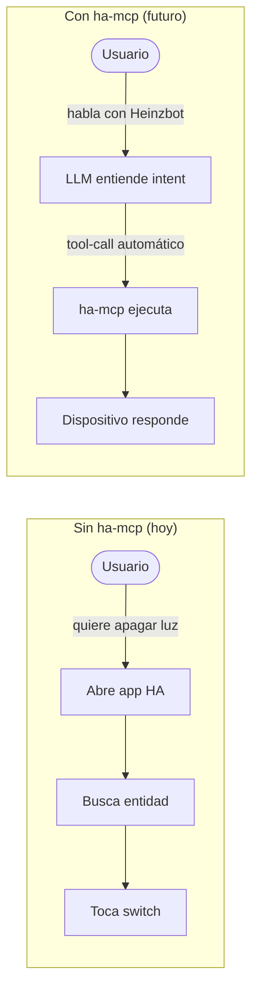
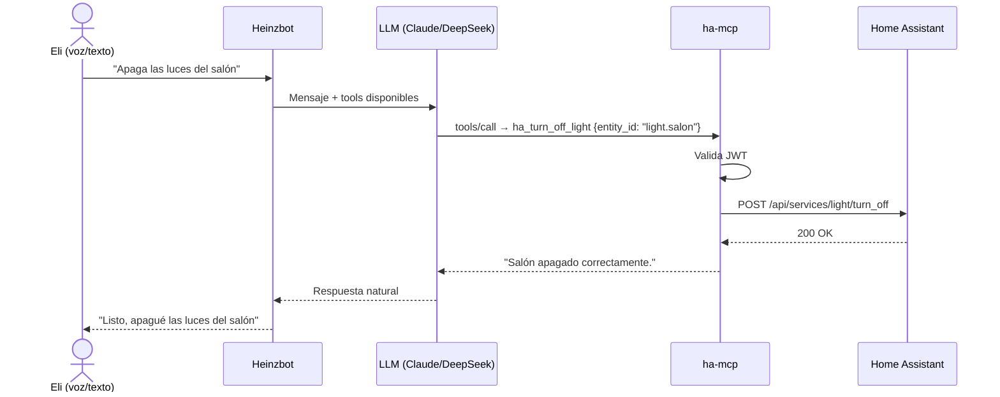

# PRD — Documento de Requisitos del Producto

**Proyecto:** ha-mcp  
**Versión:** 1.0  
**Autor:** Eli Mandujano  
**Estado:** En desarrollo

---

## 1. Visión del producto

Permitir que Heinzbot (app Android conversacional) controle y consulte dispositivos de Home Assistant mediante lenguaje natural, sin que el usuario tenga que abrir la app de HA ni recordar nombres técnicos de entidades.

> "Oye Heinzbot, apaga todas las luces del salón" → acción real en el hogar.

---

## 2. El problema que resuelve



---

## 3. Usuarios y contexto

| Campo | Valor |
|-------|-------|
| Usuario principal | Eli Mandujano |
| App cliente | Heinzbot (Android, multi-LLM) |
| Acceso | Desde casa y fuera via HTTPS |
| Dispositivos actuales | Switches WiFi Tuya integrados en HA |
| Dispositivos futuros | Sensores, clima, cámaras, automaciones |

---

## 4. Requisitos funcionales

### RF-01 — Autenticación
- El servidor debe autenticar usuarios con credenciales de Home Assistant
- Debe emitir un JWT con validez de 8 horas
- Toda llamada a `/mcp` debe llevar un Bearer JWT válido

### RF-02 — Listar dispositivos
- El LLM debe poder consultar qué entidades existen en HA
- La respuesta debe incluir nombre amigable, entity_id y estado actual

### RF-03 — Control de luces y switches
- Encender / apagar cualquier entidad de dominio `light` o `switch`
- Soporte opcional de brillo (1-100%) para luces compatibles
- Soporte opcional de color RGB para luces compatibles

### RF-04 — Consulta de estado
- Consultar el estado actual (on/off, brillo, etc.) de cualquier entidad

### RF-05 — Auditoría
- Toda acción de escritura debe quedar registrada en `audit.jsonl`
- El registro incluye: timestamp, usuario, tool, parámetros, resultado

---

## 5. Requisitos no funcionales

| ID | Requisito | Métrica |
|----|-----------|---------|
| RNF-01 | Disponibilidad | El servicio debe reiniciarse solo si falla (systemd Restart=always) |
| RNF-02 | Seguridad | HTTPS obligatorio, JWT en toda llamada, token HA nunca expuesto al cliente |
| RNF-03 | Latencia | Respuesta al LLM en < 3 segundos en condiciones normales |
| RNF-04 | Extensibilidad | Agregar una nueva tool no debe requerir modificar el core del servidor |
| RNF-05 | Trazabilidad | Toda acción queda registrada con usuario y timestamp |

---

## 6. Flujo principal del usuario



---

## 7. Fuera del alcance (v1.0)

- Automaciones (crear/modificar rutinas de HA)
- Cámaras / streams de video
- Notificaciones push desde HA hacia Heinzbot
- Panel web de administración
- Múltiples usuarios simultáneos con permisos diferenciados

---

## 8. Criterios de éxito (v1.0)

```mermaid
graph LR
    A{Criterio} --> B[Heinzbot puede encender/apagar un switch Tuya via chat]
    A --> C[El servidor arranca automáticamente tras reinicio del VPS]
    A --> D[Las llamadas van por HTTPS con JWT válido]
    A --> E[El audit.jsonl registra cada acción]
    A --> F[/health responde 200 OK]
```
