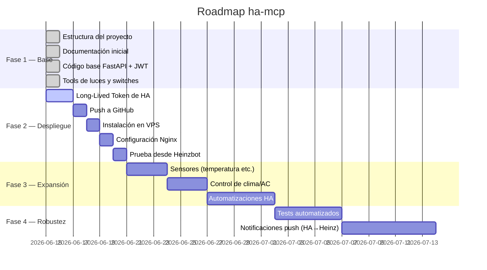
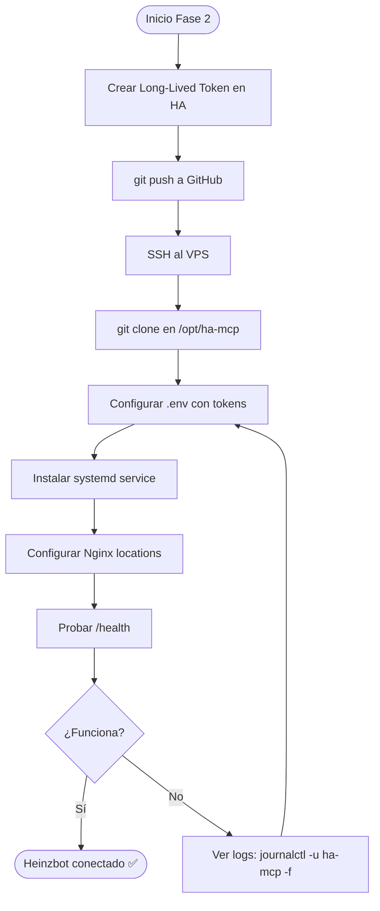
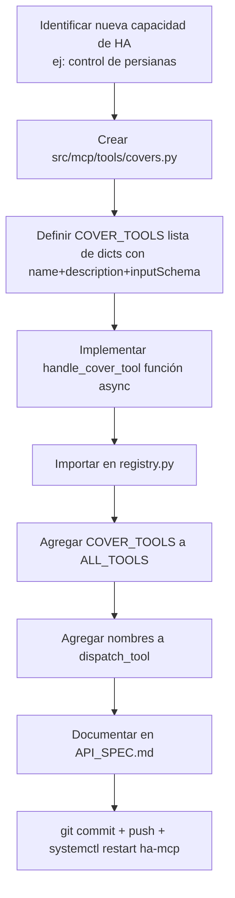

# ROADMAP.md — Hoja de Ruta del Proyecto

**Proyecto:** ha-mcp  
**Inicio:** 2026-06-15  
**Metodología:** Desarrollo iterativo asistido por IA (Claude Code)

---

## Estado actual del proyecto

---

## Fase 1 — Base del servidor ✅ COMPLETADA

**Objetivo:** El servidor MCP existe, compila y tiene la estructura correcta.

| Tarea | Estado | Descripción |
|-------|--------|-------------|
| Estructura de carpetas | ✅ | `src/`, `docs/`, `systemd/`, `tests/` |
| `.gitignore` y `.env.example` | ✅ | Configuración segura del repo |
| `requirements.txt` | ✅ | Dependencias Python definidas |
| `config.py` | ✅ | Lectura de variables de entorno |
| `auth.py` + `auth_router.py` | ✅ | JWT + endpoint /auth/login |
| `ha/client.py` | ✅ | Cliente async para HA REST API |
| `mcp/protocol.py` | ✅ | Handler JSON-RPC MCP |
| `mcp/tools/lights.py` | ✅ | 4 tools: list, get, on, off |
| `mcp/tools/registry.py` | ✅ | Catálogo y despachador de tools |
| `main.py` | ✅ | FastAPI app + /health |
| `systemd/ha-mcp.service` | ✅ | Servicio Linux |
| Documentación (PRD, ARQ, API, HA, ROADMAP) | ✅ | Esta carpeta |

---

## Fase 2 — Despliegue en VPS ✅ COMPLETADA (2026-06-15)

**Objetivo:** El servidor corre en producción y Heinzbot puede usarlo.

### Checklist Fase 2

- [x] Crear Long-Lived Token en Home Assistant
- [x] Generar JWT_SECRET con `openssl rand -hex 32`
- [x] `git add . && git commit && git push`
- [x] SSH al VPS y clonar en `/opt/ha-mcp`
- [x] Crear y completar `/opt/ha-mcp/.env`
- [x] Instalar el servicio systemd
- [x] Verificar `curl http://127.0.0.1:8002/health`
- [x] Agregar locations `/mcp`, `/auth` y `/health` en Nginx (jarvis.heinzsport.com)
- [x] Probar login desde terminal — JWT generado correctamente
- [x] Probar `ha_list_lights` — devuelve 15 dispositivos Tuya reales
- [x] Probar `ha_turn_on_light` — enciende luz física desde terminal
- [x] Heinzbot conectado — enciende luz de la sala por voz/chat ✅

### Notas del despliegue

- Heinzbot solo acepta token Bearer preconfigurado (no flujo de login).
  Se generó un JWT de 1 año con `/tmp/gen_token.py`. Renueva en **junio 2027**.
- Se agregó `location /health` en Nginx además de `/mcp` y `/auth`
  (sin esto, `/health` lo capturaba HA y devolvía 404).
- HA moderno no soporta `grant_type=password` via API REST.
  La auth se resolvió con credenciales locales en `.env` (MCP_USERNAME / MCP_PASSWORD).
- El token HA_TOKEN compartido en el chat debe rotarse por seguridad.

---

## Fase 3 — Expansión de capacidades 📋 PLANIFICADA

**Objetivo:** Controlar más tipos de dispositivos que se agreguen a HA.

### Fase 3a — Sensores (solo lectura)

Tools nuevas:
- `ha_list_sensors` — lista sensores de temperatura, humedad, movimiento
- `ha_get_sensor_value` — consulta el valor actual de un sensor

Ejemplo de uso: *"¿Qué temperatura hay en la habitación?"*

### Fase 3b — Clima y aire acondicionado

Tools nuevas:
- `ha_get_climate_state` — estado del AC (modo, temperatura objetivo)
- `ha_set_temperature` — ajusta la temperatura objetivo
- `ha_set_hvac_mode` — cambia modo (heat, cool, fan_only, off)

Ejemplo de uso: *"Pon el aire a 22 grados en modo frío"*

### Fase 3c — Automaciones

Tools nuevas:
- `ha_list_automations` — lista automaciones disponibles
- `ha_trigger_automation` — dispara una automatización manualmente

Ejemplo de uso: *"Activa la rutina de buenas noches"*

---

## Fase 4 — Robustez y funcionalidades avanzadas 🔮 FUTURO

| Feature | Descripción |
|---------|-------------|
| Tests automatizados | pytest con mocks de la API de HA |
| Notificaciones push | HA notifica a Heinzbot cuando algo cambia (WebSocket) |
| Múltiples usuarios | Permisos diferenciados por usuario |
| Panel de auditoría | Visualizar el audit.jsonl via endpoint /admin |
| Rate limiting | Protección contra abuso de la API |

---

## Cómo agregar una nueva tool (guía para el futuro)

No es necesario modificar `main.py`, `protocol.py`, ni `auth.py` para agregar nuevas tools.
